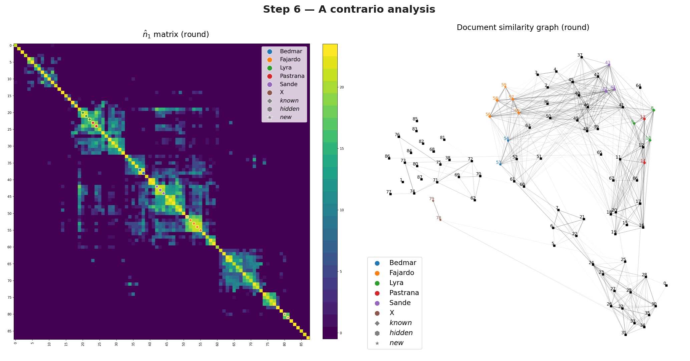
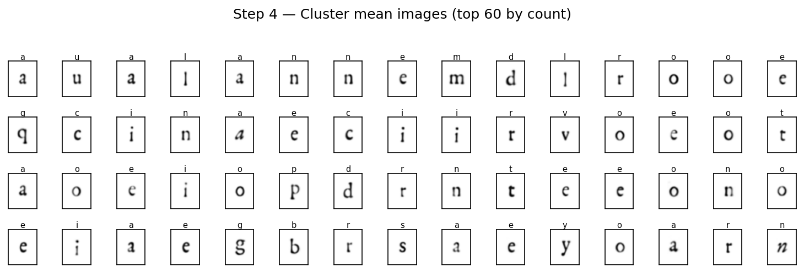
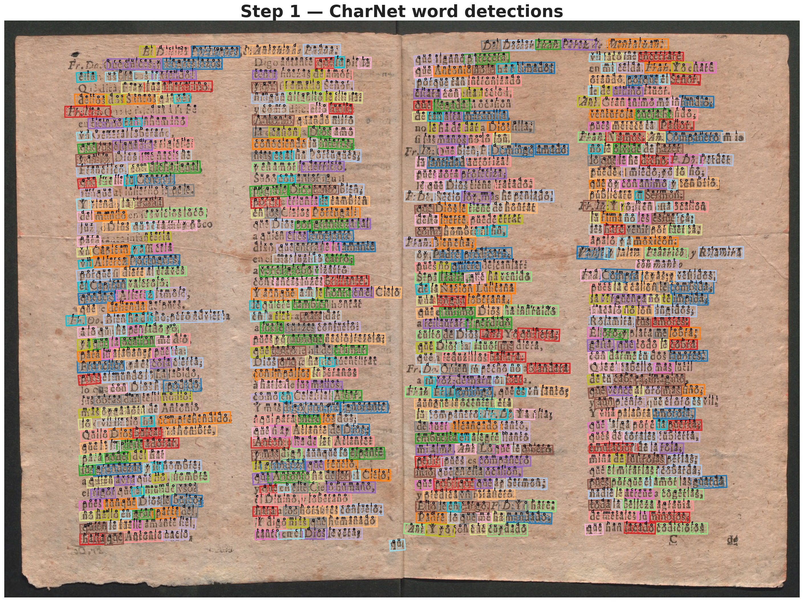
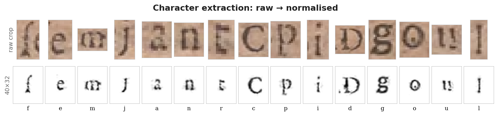
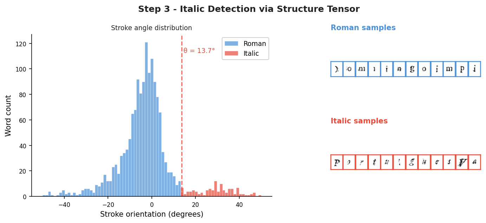
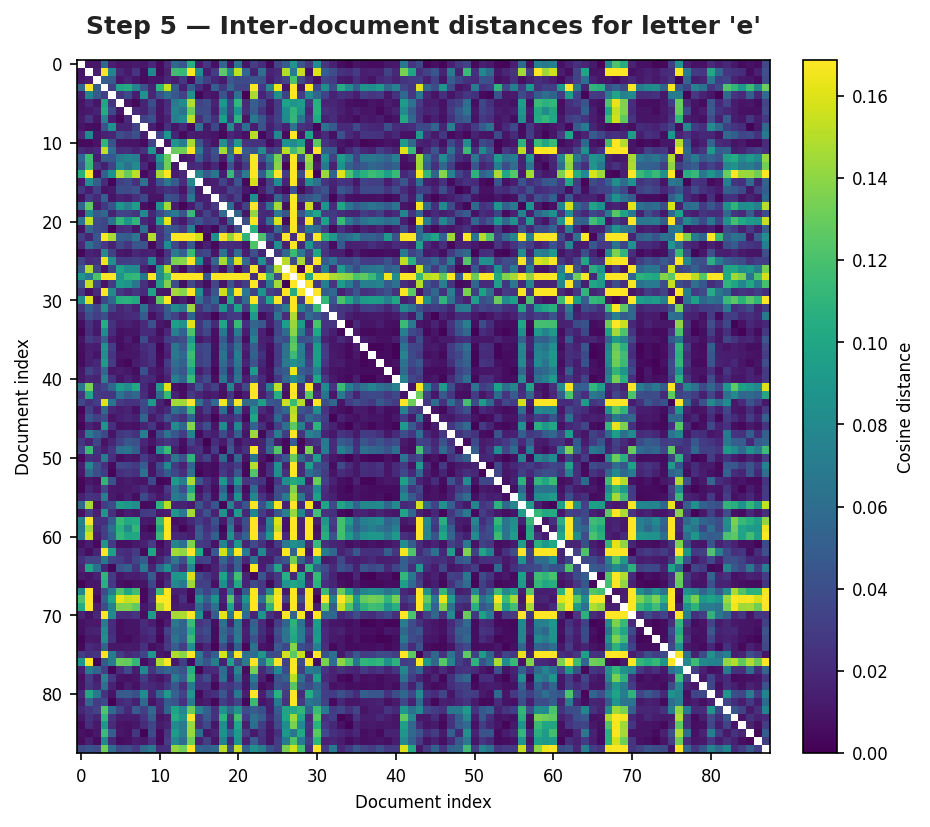

# Theatre Chapbooks At Scale: A Statistical Comparative Analysis of Typography

> Official implementation — ICDAR 2026

Unsupervised pipeline for extracting, clustering, and comparing typographic features from historical printed documents.
## Dataset
The full dataset used in this project is available at:
[https://osf.io/tkwf9/overview?view_only=6fcc7fdf07ee444d86fddd1aefe11659](https://osf.io/tkwf9/overview?view_only=6fcc7fdf07ee444d86fddd1aefe11659)

<p align="center">
  
  
</p>

---

## Installation

**Requirements:** Python 3.10+, CUDA-capable GPU recommended (CPU fallback supported but slow for CharNet).

```bash
pip install -r requirements.txt
pip install -e .
```

---

## Configuration

All configuration files live in the `configs/` directory:

| File | Description |
|------|-------------|
| `configs/icdar2015_hourglass88.yaml` | CharNet model config (input size, model weights path, char dictionary, lexicon, detection thresholds) |
| `configs/typographic_distances.yaml` | Typographic distance parameters (italic thresholds, filtering, registration, distance metric) |
| `configs/acontrario_corpus1.yaml` | A contrario analysis config for corpus 1 (analysis parameters, printer colours, figure settings) |
| `configs/acontrario_corpus2.yaml` | A contrario analysis config for corpus 2 |

**CharNet config** (`configs/icdar2015_hourglass88.yaml`): Paths for `WEIGHT`, `CHAR_DICT_FILE`, and `WORD_LEXICON_PATH` are relative to `src/charnet_src/` and are resolved automatically at runtime — the repository works from any location.

You can override the config file for most steps via command-line arguments (e.g., `--config`, `--charnet-config`).

---

## Quick Start


Run the complete pipeline on a corpus with a single command:

```bash
python scripts/run_pipeline.py data/corpus-1 --steps 1,2,3,4,5,6 --workers 4
```

Or run individual steps (see below for details).

You can also run steps 1–4 on a single document folder:

```bash
python scripts/run_pipeline.py data/corpus-1/imgs/doc001 --single-doc --steps 1,2,3,4 --workers 4
```

This will process only the specified document for detection, extraction, italic detection, and clustering.

---


## Pipeline Overview

The pipeline assumes document images (PNG) are already available, organized as:
```
data/corpus-1/imgs/
  document_001/
    page_001.png
    page_002.png
    ...
  document_002/
    ...
```

### Corpus Metadata CSV

**Required:** Each corpus folder must contain a metadata CSV file with `corpus` in its filename (e.g. `corpus_known.csv`, `ordered-table-corpus1.csv`).

**Required columns:**
- `Index`: Numbered index for each document (integer, unique per document)
- `Printer`: Printer name for each document (if known; otherwise leave blank or use `unknown`)
- `FileName`: Name of each document (should match the folder or file names exactly)

This file is used for printer attribution and document mapping. If missing, the pipeline will run but printer information will be marked as unknown and some features may be unavailable.

### Step 1 — OCR with CharNet

Detect characters and words using the CharNet neural network.  Before
running, make sure the pretrained weights are present in
`src/charnet_src/weights/icdar2015_hourglass88.pth` (see
`src/charnet_src/README.md` for download instructions and a fallback mirror).

A CUDA-capable GPU is recommended; if none is available, CharNet falls back
to CPU (significantly slower).

```bash
python scripts/run_charnet.py configs/icdar2015_hourglass88.yaml \
    data/corpus-1/imgs  data/corpus-1/charnet \
    --workers 4
```

**Output:** `data/corpus-1/charnet/{document}/{page}.json` — word/character bounding boxes with recognition scores.

<details>
<summary>Show example output</summary>



</details>

---

### Step 2 — Character Extraction via Minimum Cost Paths

Segment individual characters using graph-based minimum cost path algorithm, compute page orientations via FFT, and embed characters to fixed-size images.

```bash
python scripts/character_extraction.py \
    data/corpus-1/imgs  data/corpus-1/charnet \
    --workers 4
```

**Output:** `{page}_data.npz` files containing:
- `char_imgs` — embedded character images (40×32, normalized)
- `char_labels` — OCR labels
- `word_orientations` — page orientation per word (FFT-based)
- `word_stroke_orientations` — stroke angle per word (structure tensor)

<details>
<summary>Show example output</summary>



</details>

---

### Step 3 — Italic Detection via Structure Tensor

Classify characters as italic or round based on stroke orientation distribution.

```bash
python scripts/italic_detection.py data/corpus-1/charnet \
    --process-subfolders
```

**Output:** `italic_labels.npz` per document containing:
- `char_italic` — boolean array (True = italic)
- `threshold` — optimal separation angle

<details>
<summary>Show example output</summary>



</details>

---

### Step 4 — Unsupervised Tree Clustering

Cluster character images using GMM initialization and tree-based refinement.

```bash
python scripts/clustering.py data/corpus-1/charnet \
    --process-subfolders --workers 8
```

**Output:** `clusters_all.npz` per document containing:
- `cluster_means` — cluster centroids (40×32 images)
- `cluster_labels` — per-cluster `[label, confidence, count]`
- `cluster_italic` — mean italic ratio per cluster

<details>
<summary>Show example output</summary>


</details>

---

### Step 5 — Typographic Distance Computation

Compare documents by computing pairwise distances between cluster centroids.

```bash
python scripts/typographic_distances.py data/corpus-1
```

This processes both roman and italic styles by default. To process a single style:

```bash
python scripts/typographic_distances.py data/corpus-1 --style roman
```

**Configuration:** Parameters can be customized via `configs/typographic_distances.yaml`.

**Output:** `distances_roman.npz` and `distances_italic.npz` at corpus root containing:
- `doc_names` — document identifiers
- `printer_names` — printer attribution from metadata CSV
- `adjacencies` — (n_letters, n_docs, n_docs) distance matrices per letter
- `letters` — characters used in comparison

<details>
<summary>Show example output</summary>



</details>

---

### Step 6 — A Contrario Analysis

NFA-based detection: identify pairs of documents whose typographic similarity is
statistically significant. Produces heatmaps and UMAP similarity graphs.

```bash
python scripts/run_acontrario.py data/corpus-1 \
    --config configs/acontrario_corpus1.yaml
```

**Configuration:** Per-corpus YAML files in `configs/` control analysis parameters,
printer colours, marker shapes, and figure settings.  The `ordering` field
(average/roman/italic/index) selects how books are arranged; `index` simply uses
document indices without reordering by typographic weights.

**Output:** `results/` directory in the corpus root containing:
- `acontrario_results.npz` — n̂₁ matrices, weights, book metadata
- `matrix_round.{png,svg}`, `matrix_cursive.{png,svg}` — heatmaps
- `graph_round.{png,svg}`, `graph_cursive.{png,svg}` — UMAP graphs

<details>
<summary>Show example output</summary>


</details>

---

## Notebooks

Interactive notebooks for visualization and debugging:

| Notebook | Description |
|----------|-------------|
| `visualize_char_extraction.ipynb` | Inspect extracted characters, bounding boxes, and orientation data |
| `visualize_italic.ipynb` | Visualize italic/round classification with stroke histograms |
| `visualize_clustering.ipynb` | Browse cluster means, character assignments, and compare documents |
| `visualize_detections.ipynb` | Browse CharNet OCR detections overlaid on page images |
| `acontrario.ipynb` | Interactive a contrario analysis and graph exploration |
| `debug_char_segment.ipynb` | Debug character segmentation algorithm |
| `debug_typographic_distances.ipynb` | Debug distance computation and per-letter analysis |

---

## Utilities

### Catalogue Search

Find PDFs matching catalogue signatures and optionally copy them:

```bash
python scripts/search_pdfs.py catalogue.csv data/pdfs/ --out data/selected/ --skip-existing
```

### DPI Estimation

Compute original DPI and physical page dimensions for PDF or TIFF collections:

```bash
# Single CSV report
python scripts/compute_dpi.py data/corpus-1/pdfs -o dpi_report.csv

# Per-source CSV files (for use with convert_sources.py --dpi-csv-dir)
python scripts/compute_dpi.py data/corpus-1/pdfs -o data/corpus-1/dpis --per-file --skip-existing
```

### Source to PNG Conversion

Convert scanned PDFs and/or TIFF folders to normalized PNG page images at a
target DPI.  The input directory may contain a mix of `.pdf` files and
subfolders of `.tif`/`.tiff` pages — both are auto-detected:

```bash
# Basic conversion (PDFs + TIFF folders)
python scripts/convert_sources.py data/corpus-1/pdfs data/corpus-1/imgs

# With precomputed DPI values and parallel processing
python scripts/convert_sources.py data/corpus-1/pdfs data/corpus-1/imgs \
    --dpi-csv-dir data/corpus-1/dpis --workers 8 --skip-existing

# Custom target DPI
python scripts/convert_sources.py data/corpus-1/pdfs data/corpus-1/imgs --target-dpi 300
```

### Validate Pipeline Outputs

```bash
python scripts/validate_outputs.py data/corpus-1/charnet/doc001
python scripts/validate_outputs.py data/corpus-1/charnet --all
```

### Regenerate README Images

```bash
python scripts/generate_readme_images.py
```

---

## Repository Structure

```
scripts/                # Pipeline entry points
  ├── run_pipeline.py   # Master pipeline (steps 1–6)
  ├── run_charnet.py            # Step 1: CharNet OCR
  ├── character_extraction.py   # Step 2: MCP Character Extraction
  ├── italic_detection.py       # Step 3: Structure Tensor Italic detection
  ├── clustering.py             # Step 4: Unsupervised Clustering
  ├── typographic_distances.py  # Step 5: Typographic Distance Calculation
  └── run_acontrario.py         # Step 6: A contrario Analysis
configs/                # YAML configuration files
  ├── icdar2015_hourglass88.yaml  # CharNet model config
  ├── typographic_distances.yaml  # Distance computation params
  ├── acontrario_corpus1.yaml     # A contrario (corpus 1)
  └── acontrario_corpus2.yaml     # A contrario (corpus 2)
src/
  ├── acontrario/       # A contrario algorithms + visualization
  ├── charnet_src/      # CharNet OCR module (third-party)
  ├── image_processing/ # Orientation, segmentation, clustering
  └── typ_distances/    # Distance utilities
notebooks/              # Interactive visualization notebooks
docs/images/            # README figures (auto-generated)
data/                   # Input/output data (not tracked)
```

---

## Third-party Code

### CharNet (modified)

`src/charnet_src/` contains a modified copy of
[CharNet](https://github.com/MalongTech/research-charnet) by Malong
Technologies Co., Ltd., used here for Step 1 (character and word detection).

> Linjie Xing, Zhi Tian, Weilin Huang, Matthew R. Scott.
> *Convolutional Character Networks.* ICCV 2019.

The original code is licensed under
[CC-BY-NC-4.0](src/charnet_src/LICENSE) — **non-commercial use only**.
The pretrained weights downloaded via `download_weights.sh` are also subject
to that licence.

Changes made relative to the original are documented in
[src/charnet_src/NOTICE](src/charnet_src/NOTICE) and annotated in each
modified source file. A reference copy of the unmodified upstream source
is kept in `research-charnet-master/` for diffing purposes.

---

## Citation

```bibtex
@inproceedings{sueltas2026,
  title={Theatre Chapbooks At Scale: A Statistical Comparative Analysis of Typography},
  author={ ...},
  booktitle={ICDAR},
  year={2026}
}
```
